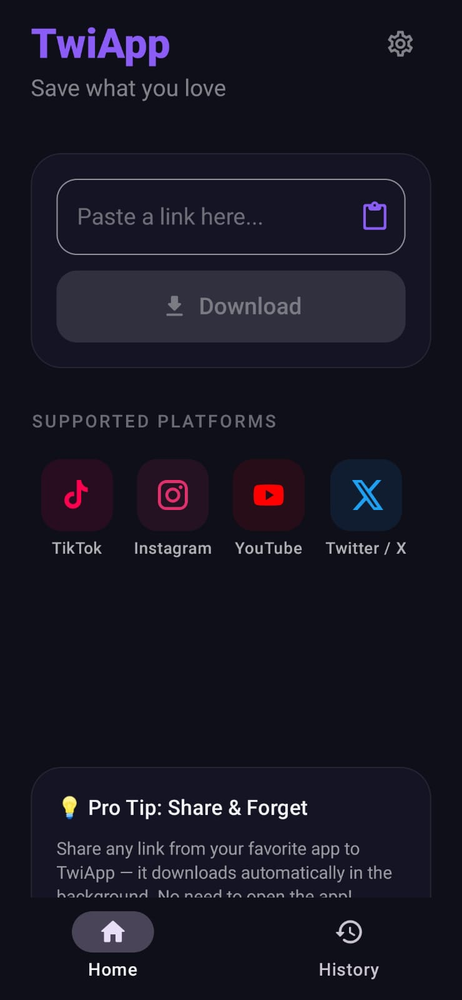

# TwiApp 📥

TwiApp is a simple, no-nonsense Android app for downloading media from your favorite social platforms directly to your phone's gallery. 

Built with Kotlin and Jetpack Compose, it's designed around a "Share & Forget" philosophy — just share a link to the app, and it handles the rest in the background.



## Features ✨

*   **Share & Forget:** Share any supported link from Instagram, TikTok, YouTube, or X directly to TwiApp. The download runs silently in the background.
*   **Auto-Paste:** Copy a link and open TwiApp. It automatically detects the clipboard link and is ready to download.
*   **Universal Support:** Powered by `yt-dlp`, supporting downloads from almost anywhere.
*   **Smart History:** Keep track of everything you've downloaded, complete with thumbnails and file sizes. Play content directly from the history tab.
*   **Clean UI:** Modern, distraction-free interface built fully in Jetpack Compose with Material 3.

## Supported Platforms 📱

Currently optimized for and visually supporting:
*   TikTok 🎵
*   Instagram 📸
*   YouTube 📺
*   X (Twitter) 🐦
*   Facebook 📘

*(Note: Because this runs on `yt-dlp` under the hood, thousands of other generic URLs will probably work too!)*

## Installation 🚀

Since this app downloads media from platforms like YouTube, it is not available on the Google Play Store.

1. Go to the [Releases](../../releases) page.
2. Download the latest `.apk` file.
3. Open the file on your Android device (you may need to allow "Install from unknown sources" in your settings).

## Building from Source 🛠️

Want to tinker with it? Awesome.

1. Clone the repo:
   ```bash
   git clone https://github.com/gpwid/twiapp.git
   ```
2. Open the project in Android Studio (Jellyfish or newer recommended).
3. Let Gradle sync.
4. Hit Run (`Shift + F10`)!

### Tech Stack
*   **Language:** Kotlin
*   **UI:** Jetpack Compose, Material 3
*   **Asynchronous:** Kotlin Coroutines & Flow
*   **Local Data:** Simple JSON persistence
*   **Media Downloader:** [JunkFood02's youtubedl-android fork](https://github.com/JunkFood02/youtubedl-android)
*   **Image Loading:** Coil

## Disclaimer ⚠️

TwiApp is a tool created for personal use to archive publicly available media. As a user, you are solely responsible for ensuring you have the right to download, store, and use the content you fetch with this app. Please respect the copyright of creators and do not redistribute downloaded material without permission.

## License 📄

This project is licensed under the MIT License - see the [LICENSE](LICENSE) file for details.
